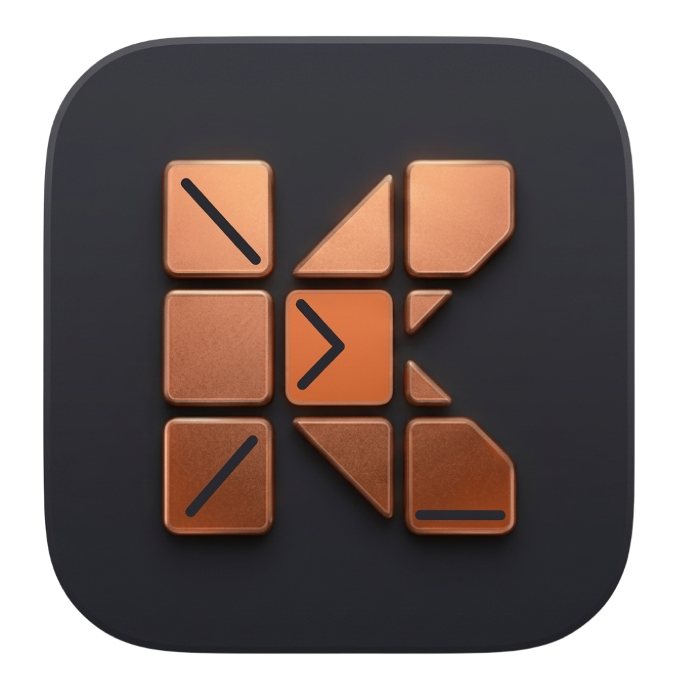
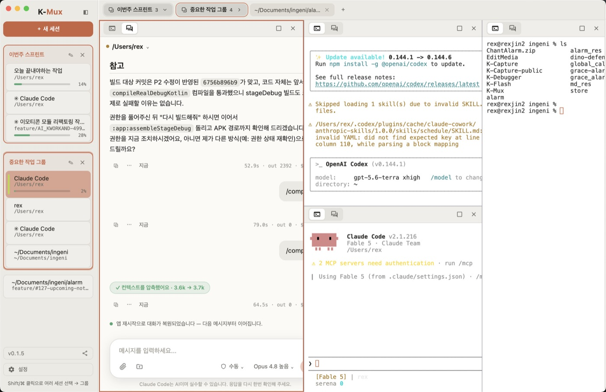
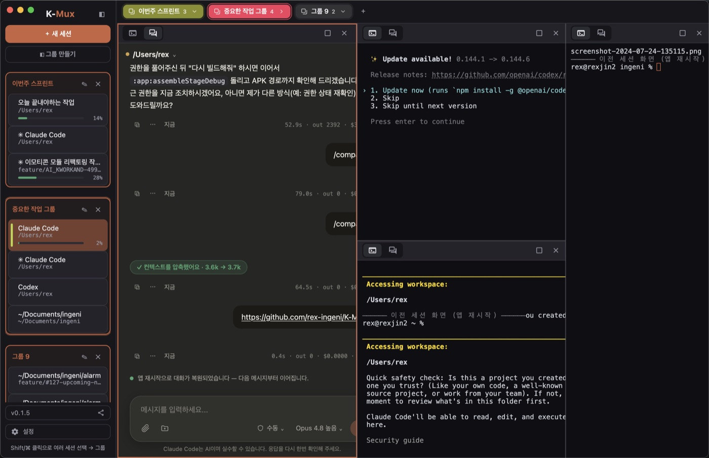
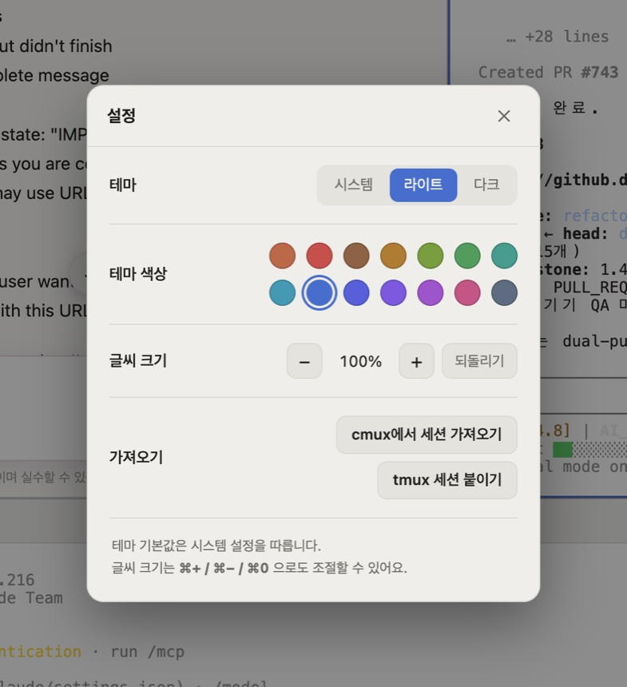
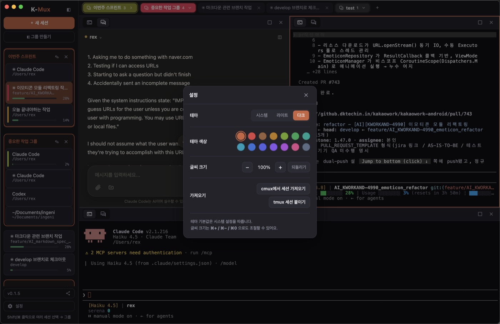

  

<h1 align="center">K-Mux</h1>

  <b>Claude Code · Codex CLI를 위한 macOS 데스크톱 앱</b> 
  CLI의 구조화 프로토콜을 앱 스타일 채팅으로 — 스트리밍 · 마크다운 · 툴 카드 · 컨텍스트 게이지

  
  
  

---

## K-Mux란

K-Mux는 **Claude Code**와 **Codex** CLI를 감싸는 macOS 앱입니다. 두 CLI가 내보내는
구조화된 스트림 프로토콜을 파싱해, 터미널 로그가 아니라 **앱 스타일 채팅 UI**로 보여줍니다.
여러 세션을 **분할 타일**로 나란히 띄우고, 각 세션을 **터미널(TUI) 탭**과 **GUI 탭**으로
자유롭게 오갈 수 있습니다.

  

  한 화면에서 여러 세션을 분할 타일로 — 왼쪽은 GUI 채팅, 오른쪽은 Claude·Codex TUI와 셸이 나란히. 
  타일 경계를 드래그해 크기 조절, 상단바를 드래그해 위치 교체·분할.

## TUI ↔ GUI — 터미널과 GUI, 나란히

K-Mux의 핵심은 **GUI가 터미널(CLI)을 대체하지 않는다**는 점입니다. 터미널 탭은 진짜 CLI(실
PTY)를 그대로 돌리고, GUI 탭은 그 CLI가 말하는 **같은 스트림 프로토콜을 파싱해 그린 채팅
화면**입니다.

- 그래서 **터미널에서 쓰던 기능 그대로** — 슬래시 커맨드, 권한 모드, 모델 선택, `/compact`
  같은 것들이 GUI에서도 동일하게 동작합니다. GUI가 흉내 낸 게 아니라 **같은 CLI 프로토콜**을
  그려주기 때문입니다.
- 한 세션(작업 폴더)에는 **터미널 탭**과 **GUI 채팅 탭**이 함께 있고, 탭으로 화면을 오갑니다.
  다만 두 탭은 **서로 독립된 대화**입니다 — 같은 폴더 위에서 돌 뿐, 터미널의 대화와 GUI의
  대화는 별개예요.
- 앱을 껐다 켜도 각 대화가 **복원**되어 다음 메시지부터 이어집니다.

  

  왼쪽 GUI 채팅(스트리밍 · 툴 카드 · 컨텍스트 압축 표시 · 권한 모드/모델 선택)과 
  오른쪽 실제 Claude·Codex TUI가 같은 화면에서 나란히.

## 테마 · 글씨 크기

- 🌗 **라이트 / 다크 / 시스템** 테마 — OS 설정을 따라가거나 직접 고정.
- 🎨 **14가지 테마 색상** — 주황·파랑·초록·보라 등 원하는 강조색을 스와치로 선택. GUI와
  터미널 커서 색까지 함께 바뀝니다.
- 🔎 **글씨 크기 조절** — `⌘+ / ⌘− / ⌘0` 또는 트랙패드 **핀치 줌**으로 GUI·TUI 모두 확대/축소.

<table>
  <tr>
    <td width="50%"></td>
    <td width="50%"></td>
  </tr>
  <tr>
    <td align="center">라이트 테마 + 색상 스와치</td>
    <td align="center">다크 테마 + 색상 스와치</td>
  </tr>
</table>

## 주요 기능

- 💬 **실시간 스트리밍 채팅** — 응답이 토큰 단위로 흐릅니다.
- 📝 **마크다운 · 링크 미리보기 · 코드 하이라이트** — 인라인 SVG 다이어그램도 바로 렌더링.
- 🧰 **툴 카드** — 셸 실행 · 파일 편집 · MCP 툴 호출을 접이식 카드로 정리.
- 📁 **작업 폴더 패널** — 생성·수정된 파일을 한눈에.
- 📊 **컨텍스트 게이지 · 압축 표시** — 남은 컨텍스트를 정확히, 압축되면 그 결과까지.
- 🔀 **터미널 ↔ GUI 전환** — 세션마다 실 PTY와 GUI를 오갑니다.
- 🪟 **분할 타일 · 그룹** — 여러 세션을 나란히 배치하고 그룹으로 묶어 관리.
- 🔒 **승인 카드 · 권한 모드** — 샌드박스 밖 작업 허용/거부, 수동·자동 등 모드 선택.
- 📥 **세션 가져오기** — cmux 워크스페이스나 실행 중인 tmux 세션을 K-Mux로 불러오기.
- 🌗 **메뉴바 트레이** — 라이트/다크에 자동 적응하는 아이콘.
- ⬆️ **업데이트 알림 · 원클릭 설치** — 새 버전을 자동 감지해 알려주고, 버튼 한 번으로 설치.

## 다운로드 & 설치

1. [**최신 릴리스**](https://github.com/rex-ingeni/K-Mux/releases/latest)에서
   `K-Mux-<버전>-arm64.dmg`를 받습니다. *(Apple Silicon / macOS)*
2. DMG를 열고 **`K-Mux.app`을 `Applications` 폴더로 드래그**한 뒤 실행합니다.

> 처음 실행 시 "확인되지 않은 개발자" 경고가 뜨면 **우클릭 → 열기**로 한 번만 허용하면 됩니다. 
> *(함께 제공되는 `.app.zip`은 앱의 **자동 업데이트**가 사용하는 파일입니다 — 직접 받을 필요 없습니다.)*

## 업데이트

새 버전은 앱이 **자동으로 감지**해 알려주고, **설치는 버튼 한 번**으로 진행합니다.

- 새 버전이 있으면 좌측 패널 하단의 **업데이트 확인** 버튼에 `● 업데이트 v0.1.x` 배지가
  뜨거나, 메뉴바 트레이 메뉴에 **업데이트 하기**가 나타납니다.
- 이 버튼을 누르면 **다운로드 → 무결성 검증 → `.app` 교체 → 재실행**까지 한 번에 진행됩니다.
  직접 압축을 풀거나 재설치할 필요가 없습니다. *(감지는 자동, 설치는 사용자가 눌러야 시작됩니다.)*

## 요구 사항

- macOS (Apple Silicon)
- [Claude Code](https://claude.com/claude-code) 그리고/또는 Codex CLI 설치

---

이 저장소는 배포 · 소개 전용입니다 — <code>version.json</code> 매니페스트와 릴리스 바이너리만 두고 소스코드는 포함하지 않습니다.
